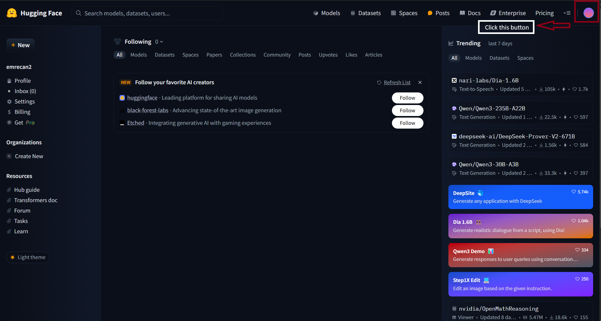
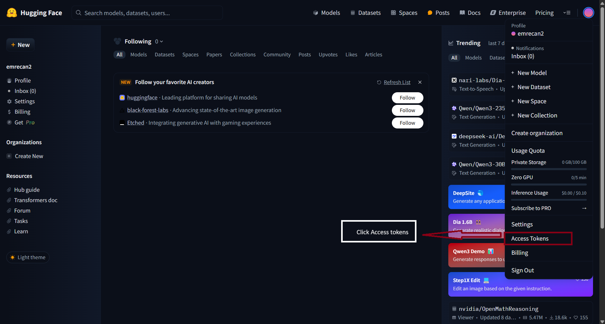
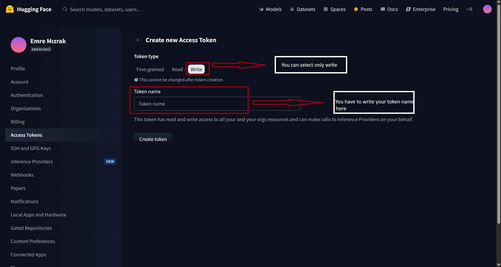
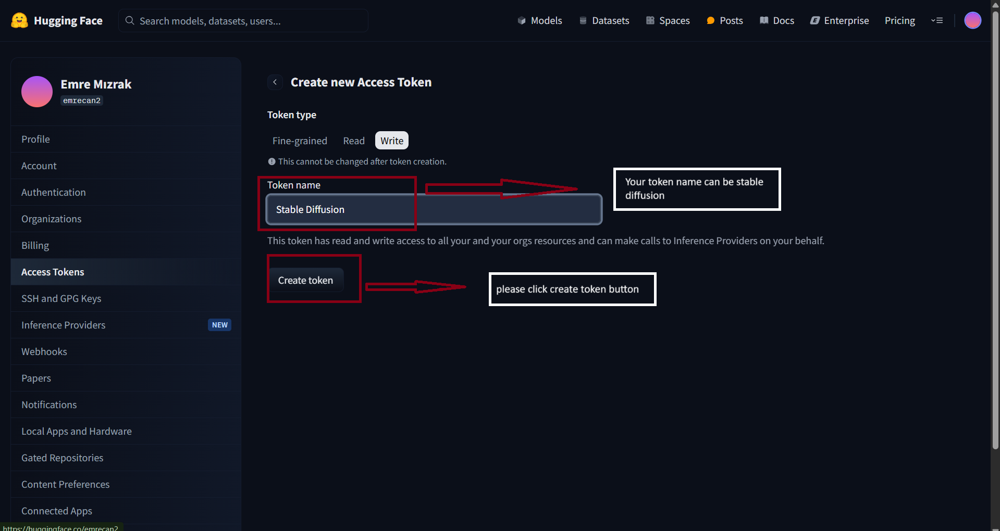
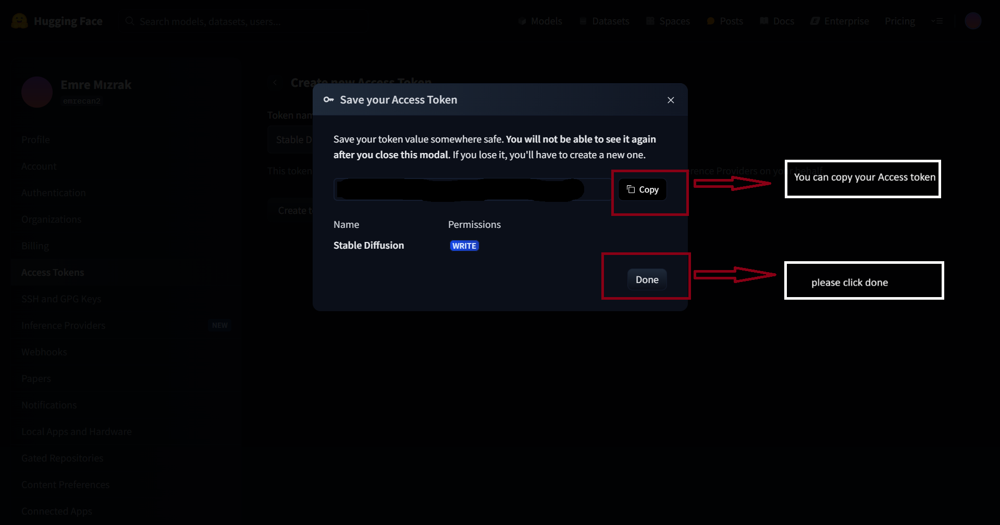
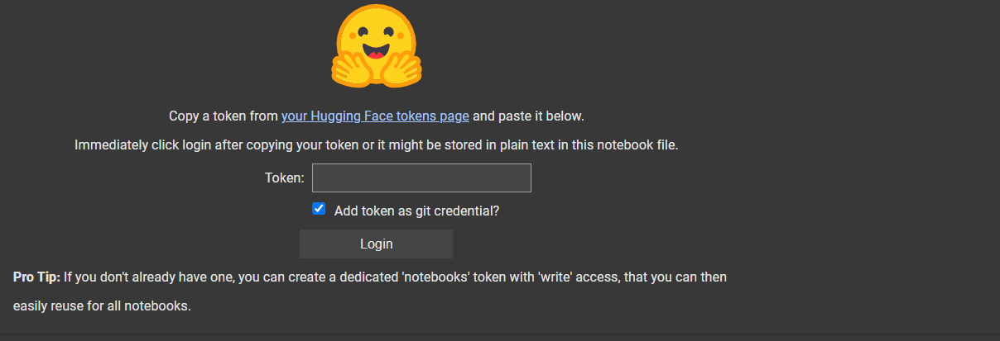

# 🧺 Stable Diffusion Lab

Welcome to the **Stable Diffusion Lab**, a Google Colab-based project that uses the powerful [Stable Diffusion v1.5](https://huggingface.co/runwayml/stable-diffusion-v1-5) model to generate stunning images from text prompts using GPU acceleration.

---

## 🔧 Setup

1. Clone or open the notebook in Google Colab.
2. Install required libraries:
    ```python
    !pip install diffusers transformers accelerate scipy safetensors
    ```
3. Login to Hugging Face:
    ```python
    from huggingface_hub import notebook_login
    notebook_login()
    ```

---

## 🧑‍💻 Hugging Face Access Token Nasıl Alınır?

Stable Diffusion modelini kullanabilmek için Hugging Face'den bir erişim token'ı alman gerekiyor.  
Aşağıdaki adımları takip ederek kolayca token oluşturabilirsin:

### 🏃‍♀️ 1. Hugging Face'e Git

[https://huggingface.co](https://huggingface.co) adresine gidip hesabına giriş yap.

  
*Ayarlara tıkla*

### ⚙️ 2. Access Tokens Sayfasına Git

Açılan menüde **"Access Tokens"** sekmesine tıkla.

  
*Access Tokens'a tıkla*

### ⚡ 3. Yeni Token Oluştur

**"New token"** butonuna tıklayarak yeni bir token oluştur.

- **Role** kısmını `read` olarak seç ve token’a bir isim ver (örneğin: `stable-diffusion`).

  
*Read'ı seç ve isim gir*

### ➕ 4. Token'ı Oluştur

Token adını belirledikten sonra **Create Token** butonuna tıkla.

  
*Token adı "stable-diffusion" olabilir ve Create Token’e tıkla*

### ✅ 5. Token’ı Kopyala

Oluşturduğun token’ı kopyala ve ardından **Done** butonuna tıkla.

  
*Access token’i kopyala ve Done’a bas*

### 💻 6. Colab Üzerinde Giriş Yap

Notebook’ta aşağıdaki kodu çalıştır:

```python
from huggingface_hub import notebook_login
notebook_login()
 ```
### Token'ı Yapıştır


kopyaladığın token'ı bu ekrana yapıştır.

